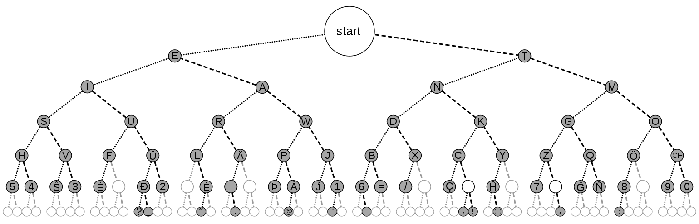
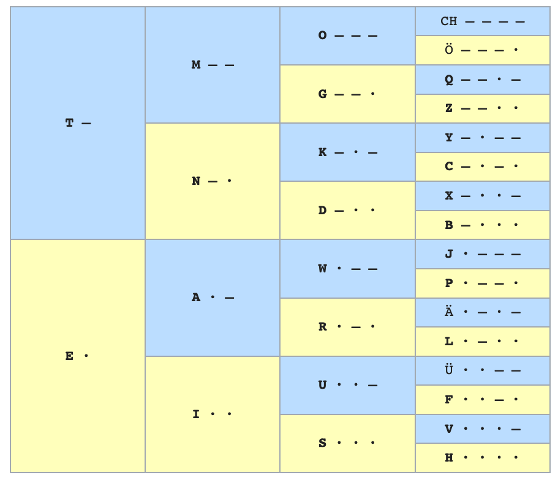

# Text to morse to audio

- Morse _signs_ from <https://onlineasciitools.com/convert-ascii-to-morse>


# run with mac

```
$ brew install kotlin
$ kotlinc Morse.kt -include-runtime -d out.jare
$ java -jar out.jar
```

# search table

Interesting pattern for the morse code



or 

